# NeoMatchup [](https://gitdiagram.com/aswina1636/neomatchup?utm_source=readme&utm_medium=badge)

Welcome to **NeoMatchup** (formerly NeoPlato) — a modern, multi-game hub built with Python and Tkinter!

## Architecture

[](https://gitdiagram.com/aswina1636/neomatchup?utm_source=readme&utm_medium=picture)

## Technologies & Modules Used
This project was entirely built using native Python technologies without heavy external game engines (like Pygame or Unity). Here is everything we used:

1. **Python 3.x**: The core programming language.
2. **Tkinter (`tkinter`)**: The standard GUI library for Python, used for drawing all the graphics, window management, and handling user inputs.
3. **Tkinter Canvas**: Used extensively for drawing the games (Snake, Sudoku, Chess, 2048, etc.), rendering custom scrollbars, creating the data visualization charts (Pie Chart & Bar Chart) in the profile, and drawing micro-animations (like the sparkling particle effects).
4. **Custom Theme Engine**: A custom color interpolation and theming system (`core.theme`) that handles the dark mode UI, vibrant colors, and aesthetic styling.
5. **JSON Storage**: `json` and `os` modules were used to save and load player profiles, high scores, NeoCoins balance, and unlocked achievements locally (`core.storage`).
6. **Sockets (`socket`)**: Used for the P2P Online Multiplayer system. We created a local server/client architecture using standard TCP sockets.
7. **Threading (`threading`)**: Used to run the multiplayer server listener in the background without freezing the Tkinter main UI loop.
8. **Base64 (`base64`) & Struct (`struct`)**: Used in `multiplayer/utils.py` to seamlessly encode a player's IP address and Port into a simple alphanumeric "Connect Code" that friends can share to join games.

## Core Features

| Feature | Description |
| :--- | :--- |
| **🎮 10 Playable Games** | A diverse collection of 10 classic and modern games seamlessly integrated into one app. |
| **✨ Unified Interface** | Smooth navigation and a modern, beautiful dark-mode UI with particle animations and transitions. |
| **💰 Virtual Currency** | Earn "NeoCoins" by playing and winning games. Spend them in the built-in Shop! |
| **👤 Player Profile** | Detailed statistics tracking including interactive pie charts (games played) and bar charts (playtime). |
| **🏆 Achievements** | Over 30 unique achievements to unlock by hitting milestones and mastering the different games. |
| **🌐 Multiplayer** | Local hot-seat support and online peer-to-peer multiplayer using custom Connect Codes! |

## The Game Roster
NeoMatchup includes the following 10 fully-playable titles:
1. **Sudoku**: The classic number puzzle with multiple difficulty levels and a hint system.
2. **Chess**: Fully featured 2-player chess board with move validation and online multiplayer.
3. **Tic-Tac-Toe**: A quick, classic 3x3 game supporting both local and online versus modes.
4. **Snake**: The retro arcade classic where you eat food to grow, featuring variable speed settings.
5. **Minesweeper**: Clear the minefield without detonating any bombs. Supports custom grid sizes!
6. **2048**: Slide and merge tiles to reach the elusive 2048 tile in this addictive puzzle game.
7. **Connect Four**: Drop your colored discs to connect four in a row against a friend.
8. **Memory Match**: Test your memory by flipping cards and finding matching pairs.
9. **Roulette**: A casino-style game where you can bet your hard-earned NeoCoins on numbers and colors.
10. **Wordle**: Guess the hidden 5-letter word in 6 tries, with color-coded feedback on each guess.

## Running the Game

### Method 1: Using the Standalone Executable (No Python Required)
We provide standalone builds for both Windows and Linux!
- **Windows**: Navigate to the `dist/NeoPlato/` directory and simply double-click `NeoPlato.exe`.
- **Linux**: Compile your own Linux executable by opening your terminal in the root folder and running `bash build_linux.sh` (requires Python & PyInstaller installed locally). This will place the standalone binary in the `dist/NeoPlato` folder.

### Method 2: Running from Source
To run NeoMatchup natively via Python:
1. Make sure you have Python 3.x installed.
2. Ensure you've installed required packages from `requirements.txt` (if applicable).
3. Run the following command in your terminal:
   ```bash
   python main.py
   ```

## Multiplayer Setup (Online)
Some games support online play! To play with a friend in a different location:
1. The **Host** clicks "Host Game".
2. The **Host** either sets up Port Forwarding on their router (port `52401`) OR both players join a Virtual LAN like **Hamachi** or **ZeroTier**.
3. The **Client** clicks "Join Game" and enters the Host's Public IP (or Virtual LAN IP) to connect!

## Why `.pyc` Instead of `.py`?
If you browse the source code for this project, you may notice that the core game logic is stored in `.pyc` (Python Compiled) bytecode files instead of traditional `.py` source text files. 

During the development cycle, a critical file corruption event occurred that wiped the raw `.py` source text files. As professional developers, we leveraged Python's `__pycache__` mechanism to fully recover the game. Python automatically compiles all imported `.py` files into `.pyc` bytecode files before execution. These `.pyc` files contain the exact same logic, are perfectly valid for the Python interpreter to run, and actually execute *slightly faster* than `.py` files because the compilation step is skipped! 

To add new features and updates, we use a single uncompiled `main.py` file that imports these `.pyc` modules and dynamically "monkey-patches" the compiled classes at runtime—a powerful advanced Python technique that allows us to seamlessly update the game without needing the original uncompiled source code.

Enjoy playing NeoMatchup!

```mermaid
%% Generated by https://gitdiagram.com/aswina1636/neomatchup
flowchart TD

subgraph group_app["Hub and UI"]
  node_entry["Application entry<br/>[main.py]"]
  node_hub["Game hub<br/>[hub.py]"]
  node_theme["Theme engine<br/>[theme.py]"]
  node_animations["Canvas animations<br/>[animations.py]"]
  node_sounds["Sound effects<br/>[sounds.py]"]
end

subgraph group_games["Game Play"]
  node_base["Game framework<br/>[base_game.py]"]
  node_roster["Game roster"]
  node_chess["Chess<br/>[chess.py]"]
  node_connect4["Connect Four<br/>[connect_four.py]"]
  node_game2048["2048<br/>[game2048.py]"]
  node_memory["Memory Match<br/>[memory_match.py]"]
  node_minesweeper["Minesweeper<br/>[minesweeper.py]"]
  node_roulette["Roulette<br/>[roulette.py]"]
  node_snake["Snake<br/>[snake.py]"]
  node_sudoku["Sudoku<br/>[sudoku.py]"]
  node_tictactoe["Tic-Tac-Toe<br/>[tictactoe.py]"]
  node_wordle["Wordle<br/>[wordle.py]"]
end

subgraph group_player["Player Progress"]
  node_profile["Player profile<br/>[profile.py]"]
  node_shop["NeoCoin shop<br/>[bank_shop.py]"]
  node_achievements_page["Achievements page"]
  node_settings["Settings<br/>[settings.py]"]
  node_storage[("JSON storage<br/>[storage.py]")]
  node_bankroll["NeoCoin economy<br/>[bankroll.py]"]
  node_achievements["Achievement rules<br/>[achievements.py]"]
end

subgraph group_network["Online Play"]
  node_client["Relay client<br/>[client.py]"]
  node_server["Relay server<br/>[server.py]"]
  node_connect_codes["Connect codes<br/>[utils.py]"]
  node_roulette_patch["Online roulette extension<br/>[roulette_patch.py]"]
end

node_player_actor(("Player"))
node_friend(("Remote player"))

node_player_actor -->|"launches"| node_entry
node_entry -->|"loads hub"| node_hub
node_hub -.->|"offers games"| node_roster
node_roster -.->|"shares framework"| node_base
node_base -.->|"uses"| node_theme
node_base -->|"accesses"| node_storage
node_base -->|"accesses"| node_bankroll
node_base -->|"checks"| node_achievements
node_base -->|"accesses"| node_sounds
node_chess -->|"inherits"| node_base
node_connect4 -.->|"inherits"| node_base
node_game2048 -.->|"inherits"| node_base
node_memory -.->|"inherits"| node_base
node_minesweeper -.->|"inherits"| node_base
node_roulette -->|"inherits"| node_base
node_snake -.->|"inherits"| node_base
node_sudoku -.->|"inherits"| node_base
node_tictactoe -.->|"inherits"| node_base
node_wordle -.->|"inherits"| node_base
node_profile -->|"reads and saves"| node_storage
node_shop -.->|"spends coins"| node_bankroll
node_achievements_page -.->|"shows progress"| node_achievements
node_settings -.->|"persists settings"| node_storage
node_player_actor -.->|"navigates"| node_hub
node_friend -.->|"connects online"| node_client
node_client -.->|"sends messages"| node_server
node_server -->|"relays messages"| node_friend
node_client -.->|"uses codes"| node_connect_codes
node_chess -->|"sends moves"| node_client
node_chess -->|"displays code"| node_connect_codes
node_roulette -->|"wagers coins"| node_bankroll
node_roulette_patch -->|"extends"| node_roulette
node_roulette_patch -->|"syncs rounds"| node_client
node_base -->|"records stats"| node_storage
node_profile -.->|"styles page"| node_theme
node_roster -.->|"animates play"| node_animations

click node_entry "https://github.com/aswina1636/neomatchup/blob/main/main.py"
click node_hub "https://github.com/aswina1636/neomatchup/blob/main/hub.py"
click node_base "https://github.com/aswina1636/neomatchup/blob/main/games/base_game.py"
click node_roster "https://github.com/aswina1636/neomatchup/tree/main/games"
click node_chess "https://github.com/aswina1636/neomatchup/blob/main/games/chess.py"
click node_connect4 "https://github.com/aswina1636/neomatchup/blob/main/games/connect_four.py"
click node_game2048 "https://github.com/aswina1636/neomatchup/blob/main/games/game2048.py"
click node_memory "https://github.com/aswina1636/neomatchup/blob/main/games/memory_match.py"
click node_minesweeper "https://github.com/aswina1636/neomatchup/blob/main/games/minesweeper.py"
click node_roulette "https://github.com/aswina1636/neomatchup/blob/main/games/roulette.py"
click node_snake "https://github.com/aswina1636/neomatchup/blob/main/games/snake.py"
click node_sudoku "https://github.com/aswina1636/neomatchup/blob/main/games/sudoku.py"
click node_tictactoe "https://github.com/aswina1636/neomatchup/blob/main/games/tictactoe.py"
click node_wordle "https://github.com/aswina1636/neomatchup/blob/main/games/wordle.py"
click node_profile "https://github.com/aswina1636/neomatchup/blob/main/pages/profile.py"
click node_shop "https://github.com/aswina1636/neomatchup/blob/main/pages/bank_shop.py"
click node_achievements_page "https://github.com/aswina1636/neomatchup/blob/main/pages/achievements_page.py"
click node_settings "https://github.com/aswina1636/neomatchup/blob/main/pages/settings.py"
click node_storage "https://github.com/aswina1636/neomatchup/blob/main/core/storage.py"
click node_bankroll "https://github.com/aswina1636/neomatchup/blob/main/core/bankroll.py"
click node_achievements "https://github.com/aswina1636/neomatchup/blob/main/core/achievements.py"
click node_theme "https://github.com/aswina1636/neomatchup/blob/main/core/theme.py"
click node_animations "https://github.com/aswina1636/neomatchup/blob/main/core/animations.py"
click node_sounds "https://github.com/aswina1636/neomatchup/blob/main/core/sounds.py"
click node_client "https://github.com/aswina1636/neomatchup/blob/main/multiplayer/client.py"
click node_server "https://github.com/aswina1636/neomatchup/blob/main/multiplayer/server.py"
click node_connect_codes "https://github.com/aswina1636/neomatchup/blob/main/multiplayer/utils.py"
click node_roulette_patch "https://github.com/aswina1636/neomatchup/blob/main/roulette_patch.py"

classDef toneNeutral fill:#f8fafc,stroke:#334155,stroke-width:1.5px,color:#0f172a
classDef toneBlue fill:#dbeafe,stroke:#2563eb,stroke-width:1.5px,color:#172554
classDef toneAmber fill:#fef3c7,stroke:#d97706,stroke-width:1.5px,color:#78350f
classDef toneMint fill:#dcfce7,stroke:#16a34a,stroke-width:1.5px,color:#14532d
classDef toneRose fill:#ffe4e6,stroke:#e11d48,stroke-width:1.5px,color:#881337
classDef toneIndigo fill:#e0e7ff,stroke:#4f46e5,stroke-width:1.5px,color:#312e81
classDef toneTeal fill:#ccfbf1,stroke:#0f766e,stroke-width:1.5px,color:#134e4a
class node_entry,node_hub,node_theme,node_animations,node_sounds toneBlue
class node_base,node_roster,node_chess,node_connect4,node_game2048,node_memory,node_minesweeper,node_roulette,node_snake,node_sudoku,node_tictactoe,node_wordle toneAmber
class node_profile,node_shop,node_achievements_page,node_settings,node_storage,node_bankroll,node_achievements toneMint
class node_client,node_server,node_connect_codes,node_roulette_patch toneRose
class node_player_actor,node_friend toneIndigo
```


